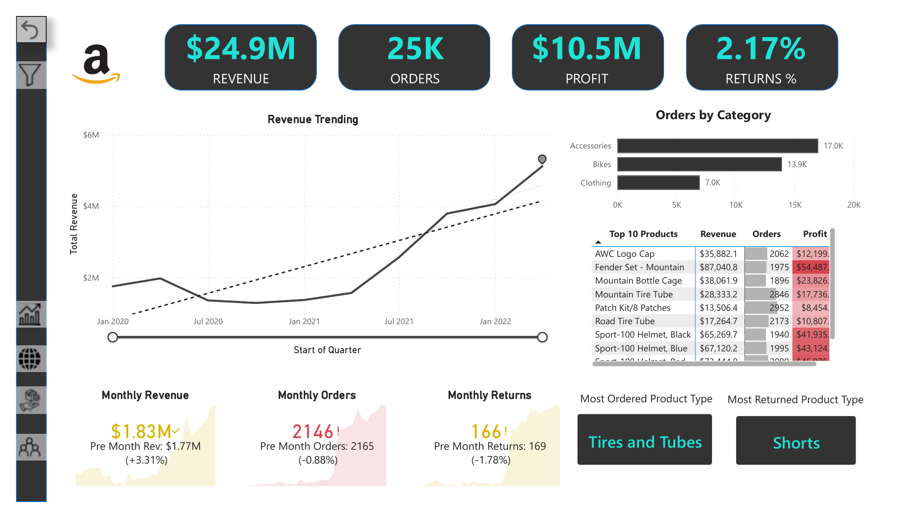
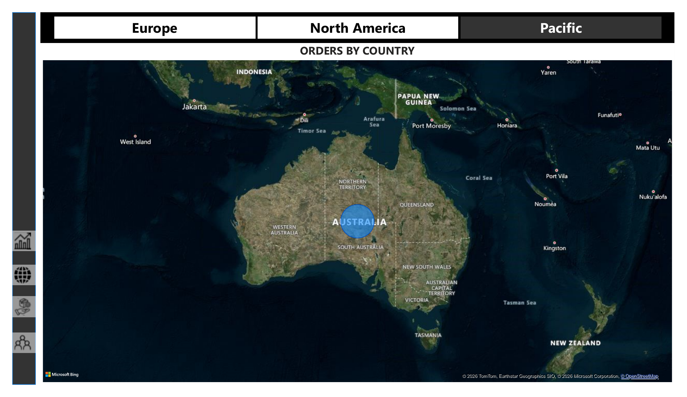
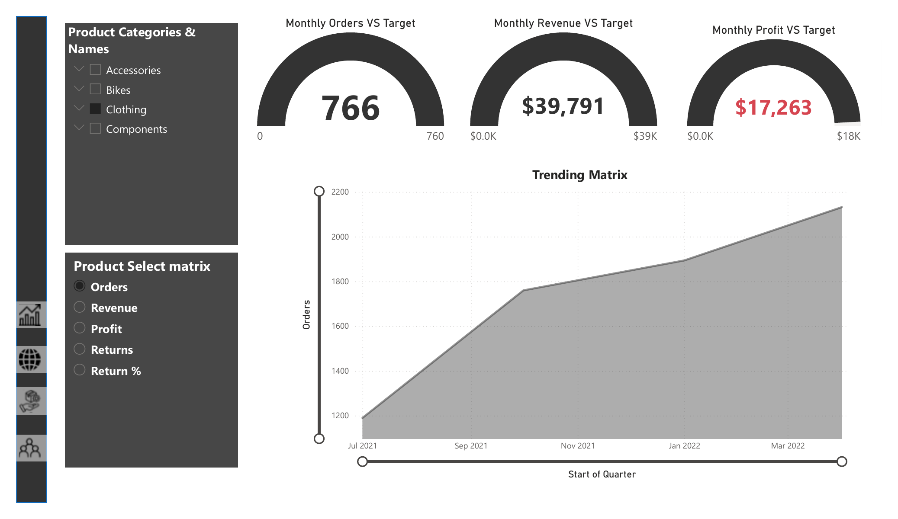
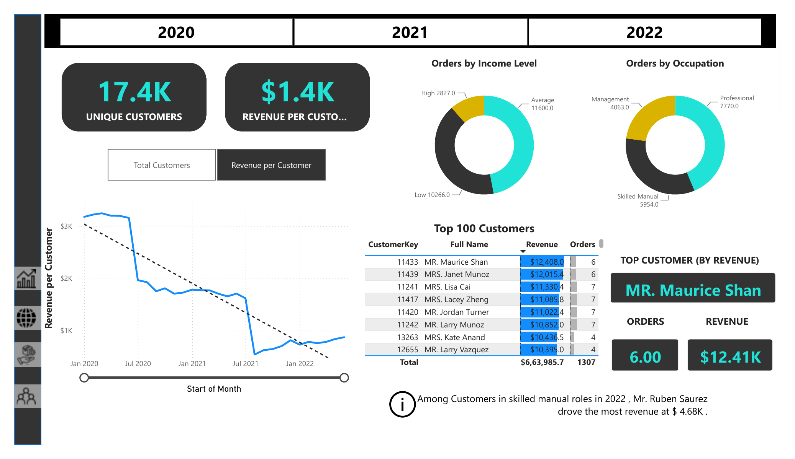
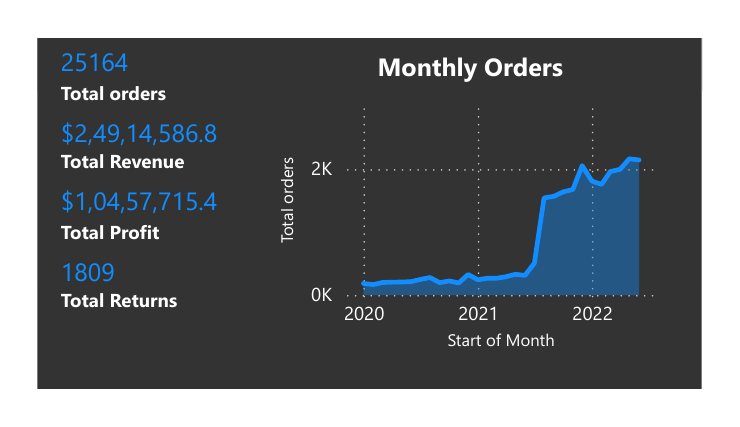

# 📊 Sales Analysis Dashboard — Power BI

An end-to-end sales performance dashboard built in Power BI Desktop, covering revenue, profit, orders, returns, and customer analytics across products, territories, and time.

## 🔍 Overview

This report analyzes retail sales performance (2020–2022) across a Sales / Product / Customer / Territory / Calendar data model, using DAX measures for KPIs, targets, and period-over-period comparisons. It's built as a 5-page interactive report with drill-through, custom tooltips, and cross-filtering slicers.

**Headline numbers:** $24.9M revenue · 25K orders · $10.5M profit · 2.17% return rate · 17.4K unique customers.

## 📄 Report Pages

| Page | What it shows |
|---|---|
| **Executive Dashboard** | KPI cards (Revenue, Orders, Profit, Returns %), a revenue trend line vs. target, monthly revenue/orders/returns vs. previous month, orders-by-category bar chart, and a Top 10 Products table |
| **Map** | Orders by country on a world map, filterable by Europe / North America / Pacific region tabs |
| **Product** | Monthly Orders / Revenue / Profit vs. target gauges, a trending line by product category (Accessories, Bikes, Clothing, Components), and a product selection matrix |
| **Customer Details** | Unique customers & revenue-per-customer KPIs, orders by income level and occupation (donut charts), a Top 100 Customers table, and a callout on the top revenue-driving customer |
| **Custom ToolTip** | A hover tooltip page showing Total Orders/Revenue/Profit/Returns alongside a monthly orders trend, surfaced on hover over other visuals |

## 🧮 Key Measures (DAX)

- Total Revenue ($24.9M), Total Profit ($10.5M), Total Orders (25K), Total Returns (1,809)
- Returns Rate (2.17%)
- Revenue / Profit / Orders Targets and Target Gap (actual vs. target variance)
- Average Revenue per Customer (17.4K unique customers, ~$1.4K revenue/customer)
- Previous Month Revenue / Orders / Returns (period-over-period comparison)

## 🛠️ Tech & Skills Demonstrated

- Power BI Desktop (Power Query, Data Modeling, DAX)
- Star-schema data modeling (Fact + Lookup tables)
- KPI and target-tracking design
- Custom tooltips and drill-through navigation
- Interactive slicers and cross-filtering
- Dashboard UX/layout design

## 📸 Screenshots

<table>
<tr>
<td></td>
<td></td>
</tr>
<tr>
<td></td>
<td></td>
</tr>
<tr>
<td></td>
<td></td>
</tr>
</table>

Full multi-page export: [`docs/Sales_Analysis_Dashboard.pdf`](docs/Sales_Analysis_Dashboard.pdf)

## ▶️ How to View

1. Download `Assignment_9.pbix` from this repo
2. Open it in [Power BI Desktop](https://powerbi.microsoft.com/desktop/) (free)
3. Explore the pages using the tabs at the bottom, and use the slicers/filters to interact with the data

> Note: This uses a sample retail dataset for portfolio/learning purposes.

## 📬 Contact

*Add your name, LinkedIn, and email/portfolio link here.*
